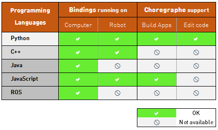
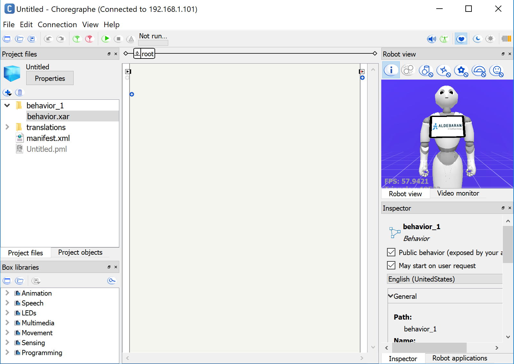
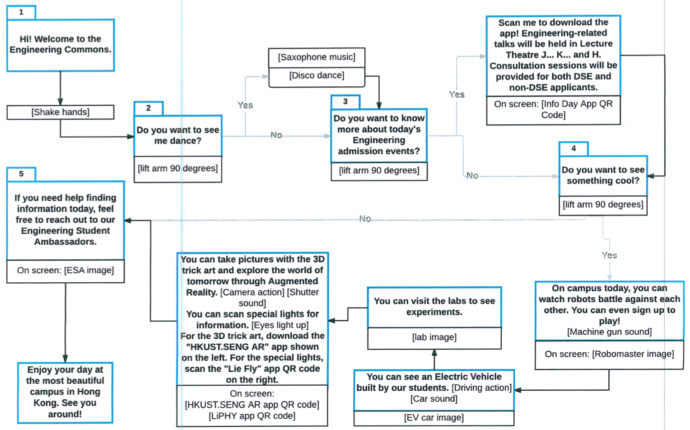

# Pepper_Nao_Basic_Tutorial
# Robot Programming
> HKUST COMP 4461 Lab materials for how to program Pepper (and Nao) with Choregraphe and Python SDK<br>
> Venue: Room 4214, Teaching Lab 2, Academic Building.<br>
> Date: Nov. 7, 2018

[![Choregraphe][chor-image]][chor-url]
[![License][license-image]][license-url]
[](http://makeapullrequest.com)

<!-- [](http://inch-ci.org/github/sunzhida/COMP4461_2017Fall_Lab2) -->
<!-- [![Build Status][travis-image]][travis-url] -->

In this lab, we will introduce how to program with [Pepper](https://www.softbankrobotics.com/emea/en/pepper) and [Nao](https://www.softbankrobotics.com/emea/en/nao) robot by Choregraphe and python SDK. In this repository, there are demos created by Choregraphe or Naoqi python (2.7) SDK for you to get started.

## Table of Contents

- [Overview](#overview)
- [Preparation for Programming](#configuration)
- [Choregraph Example](#implementation)
- [Python Example](#tips)
- [Contribute](#contribute)
- [Meta](#meta)

## Overview


### What is _Pepper_?

[Pepper](https://en.wikipedia.org/wiki/Pepper_(robot)) is a humanoid robot by Aldebaran Robotics and SoftBank designed with the ability to read emotions. Check the following links for more description of Pepper Robot: 

- [Developer guide](http://doc.aldebaran.com/2-4/family/pepper_technical/index_pep.html) 
- [How to Create a Great Experience with Pepper](http://doc.aldebaran.com/download/Pepper_B2BD_guidelines_Sept_V1.5.pdf)

### What is _Nao_?

[Nao](https://en.wikipedia.org/wiki/Nao_(robot)) (pronounced now) is an autonomous, programmable humanoid robot developed by Aldebaran Robotics, a French robotics company headquartered in Paris, which was acquired by SoftBank Group in 2015 and rebranded as SoftBank Robotics.
Check the following links for more description of Nao Robot:

- [Developer guide](http://doc.aldebaran.com/2-5/family/robots/index_robots.html)

#### Programming tools

Pepper (or Nao) robot can detect sound, people, obstacles based on its perception algorithms. The OS is a modified Gentoo distribution called OpenNAO with [NAOqi OS](https://www.ald.softbankrobotics.com/en/robots/tools) on top of it. The robotics OS runs all the software from hardware control to AI decision making.

The SoftBank provides serveral ways to program the Pepper or Nao robots, check it [here](http://doc.aldebaran.com/2-5/dev/programming_index.html).



### What is _Choregraphe_?

[Choregraphe](hhttp://doc.aldebaran.com/2-5/software/choregraphe/choregraphe_overview.html) is a multi-platform development application with graphical user interface. It allows you to create animations and behaviors on Pepper, test them on a simulated robot or directly on a real one, monitor and control Pepper and Nao, etc. 

## Preparation for Programming

### Install _Choregraphe_ or Naoqi python SDK?

For Choregraphe, refer to the official [installation guide](http://doc.aldebaran.com/2-5/software/choregraphe/installing.html). 

For Python SDK,  refer to the official [installation guide](http://doc.aldebaran.com/2-5/dev/python/install_guide.html).

You need to sign up an [account](https://community.ald.softbankrobotics.com/en/resources/software/language/en-gb) to download the software. During the installation, you may need to provide following license key: 

```
654e-4564-153c-6518-2f44-7562-206e-4c60-5f47-5f45
```


### How to use _Choregraphe_?

Before starting the application, we need to connect to the '**NaoRobotNet**' (the password will be announced during the class). Then the initial interface of the application looks like below:



For each part of the interface, i.e., toolbar and other panels, please refer to the detailed explanation from the official [website](http://doc.aldebaran.com/2-5/software/choregraphe/interface.html). There is also a chart which describes each button in details.

## Choregraph Example

After you get the `Demo` folder, please open the `.pml` file with Choregraphe, and you will see a project created by the same application previously. This project is created for the demonstration of Engineering School on [Information Day](https://infoday.ust.hk/), 2017. We will explain this demo in details:

### Flowchart

We design the workflow as below:



### Detailed explanation for each component

For each component, the detailed design is as below:

| No. | Speech | Screen | Gesture | Sound | Remarks |
| :------| :------ | :------ | :------ | :------ | :------ |
| 1 | Hi! Welcome to the Engineering Commons. | Embrace_change ||||
| 2.1 | Do you want to see me dance? | Embrace_change ||||
| 2.2 || Embrace_change | Lift forearm to 90 degrees || If `yes`, go to 2.3, otherwise go to 3.1 |
| 2.3 || Embrace_change | Disco dance | Saxophone music ||
| 3.1 | Do you want to know more about today's Engineering admission events? | Embrace_change ||||
| 3.2 || Embrace_change | Lift forearm to 90 degrees || If `yes`, go to 3.3, otherwise go to 4.1 |
| 3.3 | Scan me to download the app! Engineering related talks will be held in Lecture Theatre J... K... and H. Besides, Consultation sessions will be provided for both DSE and non-DSE applicants. | Info Day app QR code | Related gestures |||
| 4.1 | Do you want to see something cool? | Info Day app QR code ||||
| 4.2 || Info Day app QR code | Lift forearm to 90 degrees ||If `yes`, go to 4.3, otherwise go to 5.1 |
| 4.3 | On campus today, you can watch robots battle against each other. You can even sign up to play! | Robomaster_image ||||
| 4.4 || Robomaster_image | Gorilla action | Machine gun sound||
| 4.5 | You can see an electric vehicle built by our students| EVcar_image||||
| 4.6 || EVcar_image | Driving action | Car sound||
| 4.7 | You can visit the labs to see experiments. | Lab_image ||||
| 4.8 | You can take pictures with the 3D trick art and explore the world of tomorrow through Augmented Reality. | HKUST.SENG_AR_LiPHY_app ||||
| 4.9 || HKUST.SENG_AR_LiPHY_app | Camera action | Shutter sound ||
| 4.10 | You can scan special lights for information. | HKUST.SENG_AR_LiPHY_app ||||
| 4.11 || HKUST.SENG_AR_LiPHY_app | Eyes light up |||
| 4.12 | For the 3D trick art, scan the HKUST.SENG AR app QR code shown on the left. For special lights, scan the Lie Fly app QR code on the right. | HKUST.SENG_AR_LiPHY_app | Speaking gestures |||
| 5.1 | If you need help finding information today, feel free to reach out to our Engineering Student Ambassadors. | ESA_image ||||
| 5.2 | Enjoy your day at the most beautiful campus in Hong Kong. See you around! | HKUST_image | Related gestures |||

Based on the scheme, we can add and change related gestures, screen image or speech text accordingly.

### Live demo

After we finished editing the program, we can upload the program to the Pepper robot while it is in the rest mode. Then we can click the `play` button to test the program on Pepper.

In the _Demo_ folder, the additional sound and image files are stored in the `html` subfolder, while the main program is in the `show.pml` file. You can start your program based on that.

## Python Example

- [SoftBank Robotics Documentation](http://doc.aldebaran.com/)
- [Choregraphe Suite](http://doc.aldebaran.com/2-5/software/choregraphe/index.html)

## Contribute

We would love you for the contribution to **Lab3**, check the ``LICENSE`` file for more information.

## Meta

[Zhida Sun](http://zsunaj.student.ust.hk/). Distributed under the MIT license. See ``LICENSE`` for more information.

[chor-image]:https://img.shields.io/badge/Choregraphe-2.5.5-008C96.svg
[chor-url]: https://developer.softbankrobotics.com/us-en/downloads/pepper
[py-image]:https://img.shields.io/badge/Python-2.7-008C96.svg?style=flat
[py-url]: https://www.python.org/downloads/
[qi-image]:https://img.shields.io/badge/SDK-2.4.3-008C96.svg?style=flat
[qi-url]: https://community.ald.softbankrobotics.com/en/resources/software/language/en-gb/robot/pepper-3
[license-image]: https://img.shields.io/badge/License-MIT-blue.svg
[license-url]: ./LICENSE.md
[travis-image]: https://img.shields.io/travis/dbader/node-datadog-metrics/master.svg?style=flat
[travis-url]: https://travis-ci.org/dbader/node-datadog-metrics
[codebeat-image]: https://codebeat.co/badges/c19b47ea-2f9d-45df-8458-b2d952fe9dad
[codebeat-url]: https://codebeat.co/projects/github-com-vsouza-awesomeios-com
